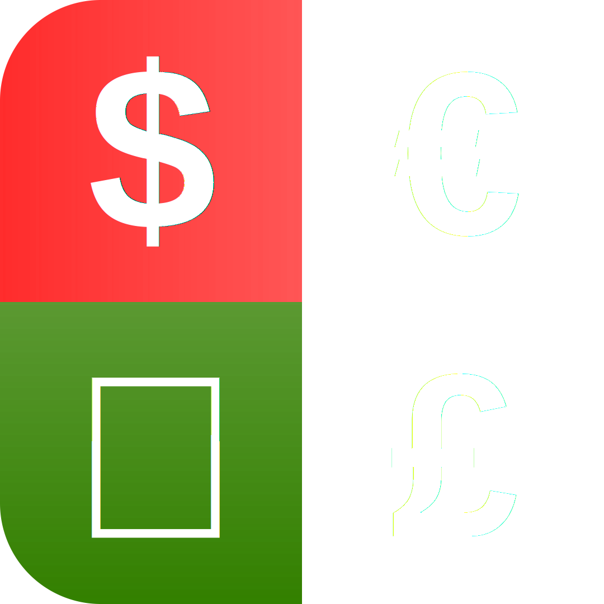
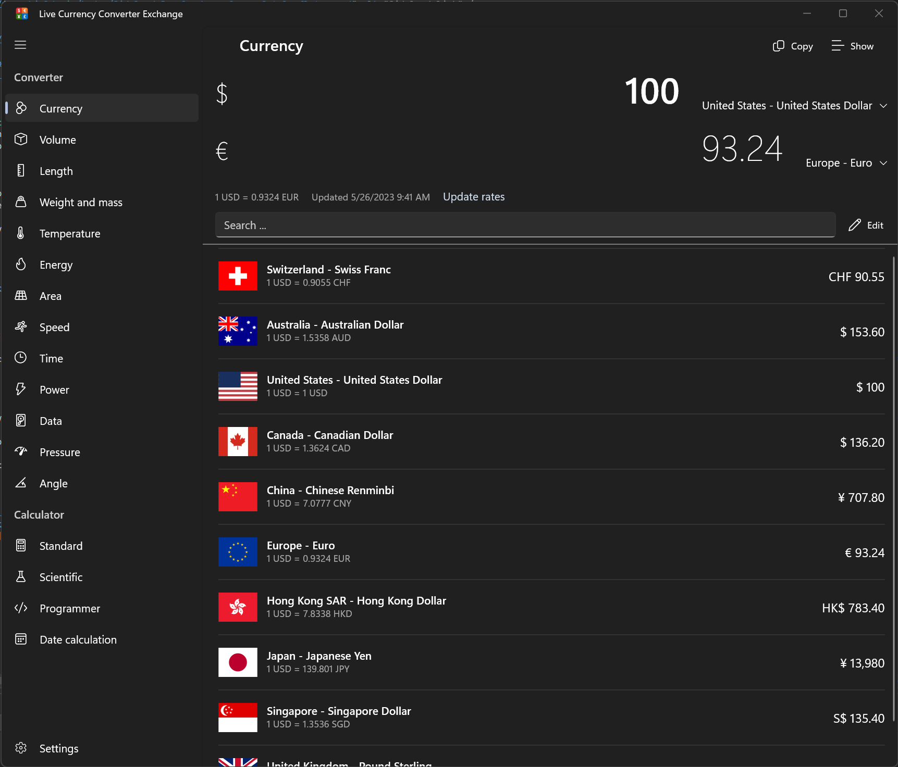
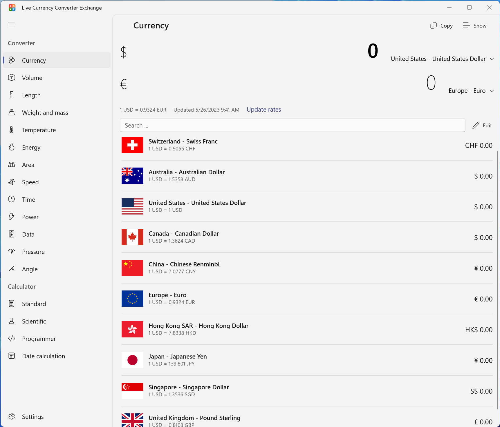

# Live Currency Converter Exchange
Live Currency Converter is a real-time currency converter with calculator function.

	

	
	
	
	
	

## About live-currency-converter 
Live Currency Converter Exchange is a real-time currency converter with calculator function. 
It provides exchange rate information for all currencies in the world (over 168 currencies), and all exchange rates are updated every hour.

### Features

- Currency conversion rates for 161 currencies.
- Exchange rates are updated every hours
- Accurate exchange rate from [exchangerate-api.com](https://www.exchangerate-api.com/)
- Support all common unit converters such as length, volume, data, etc
- Support basic calculator

### Screenshots

  

## Installation

[Visit Microsoft store websites](https://www.microsoft.com/store/apps/9PG6WJGP511T?cid=storebadge&ocid=badge) or open in Microsoft Store app:

	

## Privacy

The application “Live Currency Converter Exchange” (now called application) is a simple currency converter application. It is the easiest and fastest method to convert currencies and get exchange rate. 

**What Data We Collect and Process:** The application “Easy Backup for Browser Basic” (now called application) does not collect, store or transit any personal …

The app does not use any own telemetry functions apart from the standardised telemetry functions by Microsoft (crashes, install from which country, versions in use, custom events etc.).

## Contact

Project Link: [https://github.com/b4cstudio/live-currency-converter](https://github.com/b4cstudio/live-currency-converter)

Contact us: [b4cstudio.com](https://b4cstudio.com)

Email: [b4cstudio@outlook.com](mailto:b4cstudio@outlook.com)
